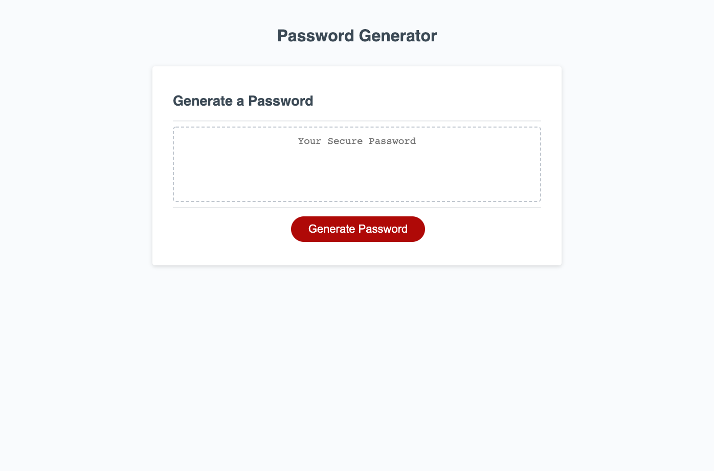

# Password Generator Starter Code

Discription:
To create a password Generator that prompts the user with questions regarding the types of elements needed for the pw to be generated. Based off the provided html, css and js files, adding the needed code so that the prompts and math logic within the game.js file.

- started with the proveded starer code files 
- used the  "generatePassword" function to prompt user with questions once button is clicked 
- added the needed prompt questions within variables to console.log the boolean to document 
- added console.logs to each question boolean 
- added while functions to prompt user if the appropreate answer isnt chosen 
- added the logic to randomly choose a character based from charCode for all characters chosen from propmts  
- added the logic to randomly choose a character from said getRandomCharacter function loop 
- made sure all characters chosen were used at least once by adding the specialChars.length to the getRandomCharater function 
- Filled in the nessicary information to write the PW in the box once fully generated 

- Git Repo - https://github.com/theoneandonlyzako/passwordGenerator 
- Direct link - https://theoneandonlyzako.github.io/passwordGenerator/   

